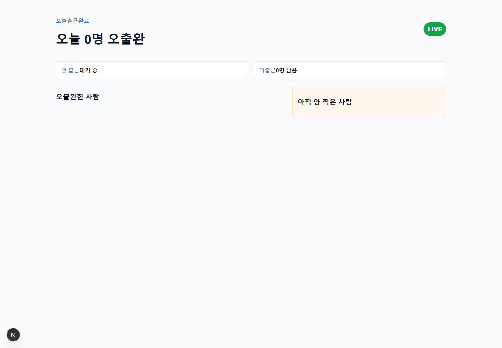

# 오출완

텔레그램 그룹 채팅방에서 `ㅇㅊㅇ`을 입력하면 출근 완료로 기록하고, 웹 대시보드에서 오늘 출근자와 미출근자를 보여주는 Next.js 앱입니다.

비용 정책은 [무과금 운영 정책](docs/policies/no-cost-policy.md)을 따릅니다. 이 프로젝트는 과금 요소가 없는 구성을 우선합니다.

## 현재 화면

현재 MVP 대시보드는 오늘 오출완 인원, 첫 출근, 미출근 인원, 출근 완료 목록, 미출근 목록을 보여줍니다.



## 현재 구현 상태

완료된 것:

- Next.js App Router 기반 프로젝트 구성
- Prisma + PostgreSQL 기준 데이터 모델 작성
- 텔레그램 Webhook 엔드포인트 구현: `POST /api/telegram/webhook`
- 텔레그램 메시지 파싱 구현: `ㅇㅊㅇ`, `/등록`, `/요청 이름`
- `ㅇㅊㅇ` 입력 시 멤버 자동 등록 및 오늘 출근 기록 생성
- 같은 날 중복 `ㅇㅊㅇ` 방지
- 오늘의 출근 순번과 랜덤 칭호 생성
- 웹 요청 API 구현: `POST /api/requests`
- 오늘 상태 API 구현: `GET /api/today`
- 웹 대시보드 UI 구현
- 테스트 작성 및 빌드 검증

아직 실제 운영 전 필요한 것:

- 실제 PostgreSQL 데이터베이스 준비
- `.env` 파일에 운영 환경 변수 입력
- Prisma migration 실행
- 배포 URL 준비
- 텔레그램 BotFather로 봇 생성
- 텔레그램 그룹에 봇 초대
- Telegram Bot API `setWebhook` 연결

## 주요 기능

- 텔레그램 그룹에서 `ㅇㅊㅇ` 메시지로 오늘 출근 체크
- 첫 `ㅇㅊㅇ` 또는 `/등록` 사용자를 자동 멤버 등록
- 오늘 출근 완료자와 아직 안 찍은 사람 목록 표시
- 웹 버튼 또는 `/요청 이름` 명령으로 `ㅇㅊㅇ` 요청
- 출근 기록 누적을 통한 추후 개인 출근 패턴 확장 기반

## 프로젝트 위치

현재 작업 경로:

```text
C:\Users\psh94\Desktop\ochulwan-log
```

현재 작업 브랜치:

```text
codex/telegram-attendance-mvp
```

원격 저장소:

```text
https://github.com/psh9408p/ochulwan-log.git
```

## 준비

```bash
npm install
cp .env.example .env
```

`.env`에 다음 값을 설정합니다.

- `DATABASE_URL`: PostgreSQL 연결 문자열
- `TELEGRAM_BOT_TOKEN`: BotFather에서 받은 텔레그램 봇 토큰
- `TELEGRAM_WEBHOOK_SECRET`: Webhook 검증용 비밀 문자열
- `TELEGRAM_CHAT_ID`: 오출완을 사용할 텔레그램 채팅방 ID

`.env.example`은 예시 파일입니다. 실제 `.env` 파일은 `.gitignore`에 포함되어 있으므로 커밋하지 않습니다.

## DB

```bash
npm run db:migrate
npm run db:generate
```

현재 Prisma 모델:

- `Member`: 텔레그램 사용자/멤버 정보
- `AttendanceRecord`: 날짜별 출근 기록
- `CheckinRequest`: `ㅇㅊㅇ 요청` 기록과 rate limit 기준 데이터

## 개발 서버

```bash
npm run dev
```

로컬 주소:

```text
http://127.0.0.1:3000
```

## 테스트

```bash
npm run test
npm run build
```

마지막 확인 기준:

- `npm run test`: 6개 테스트 파일, 11개 테스트 통과
- `npm run build`: 성공

## 텔레그램 Webhook

배포된 URL이 `https://example.com`이라면 Telegram Bot API의 `setWebhook`을 사용해 아래 엔드포인트로 설정합니다.

```text
https://example.com/api/telegram/webhook
```

Webhook secret은 `TELEGRAM_WEBHOOK_SECRET`과 같은 값으로 설정합니다.

예시 흐름:

```text
1. BotFather에서 봇 생성
2. 봇 토큰을 TELEGRAM_BOT_TOKEN에 설정
3. 봇을 사용할 텔레그램 그룹에 초대
4. 그룹 chat id를 TELEGRAM_CHAT_ID에 설정
5. 배포 URL 기준으로 /api/telegram/webhook을 setWebhook에 등록
6. 그룹에서 ㅇㅊㅇ 입력
7. 웹 대시보드에서 출근 상태 확인
```

